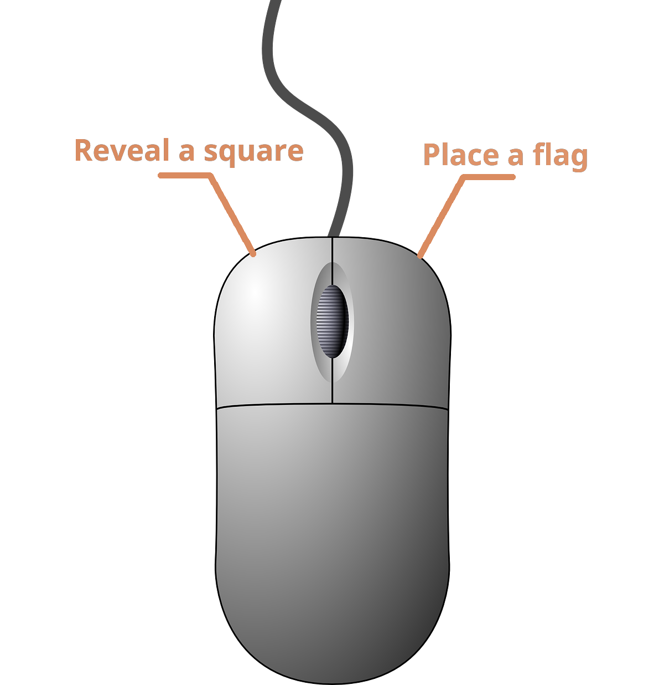
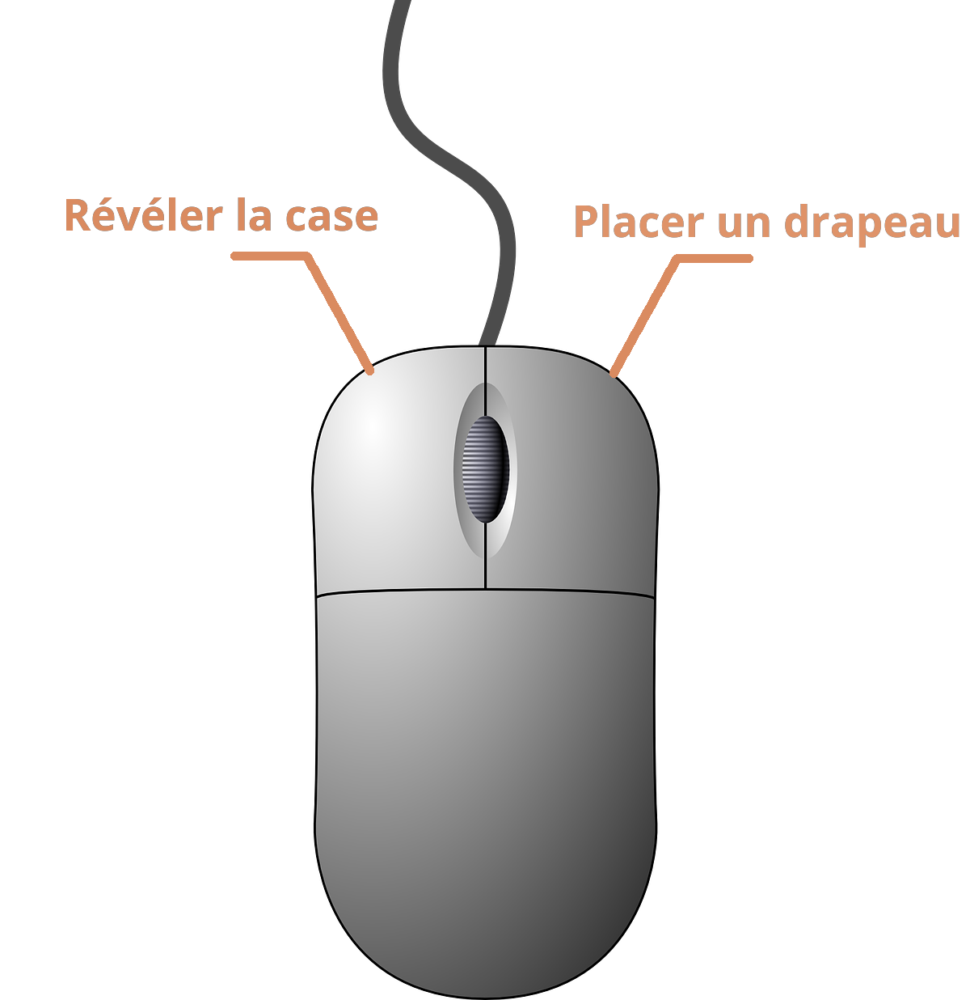

> English
# **Minesweeper**

### The Objectif:
* The objectif is to __*clear the minefield of every bomb without detonating any of them*__.

## How to play the game?

### Rules
* You can reveal a square of land by left clicking it.
* Once revealed, the case can show a number, from 0 to 8, which give you a hint about the number neighbors containing a bomb.
* **But beware!** If you activate a bomb under the ground, it will cause a chain reaction, leading to a big explosion, thus ending the game.
* This is why we provide you the flag to mark the squares containing a bomb. Keeping you from making mistakes that could end your minesweeper career. You can use this tool by right clicking a square of land.

### Control details:

[Project Repository](https://github.com/Me-k-01/Projet_Python)

---
---

> Francais
# **Le Démineur**

 ### Objectif:
* Le but du jeu est de __*déminer toutes les bombes*__ du champ de mines, **sans en faire exploser**.

## Comment jouer?

### Règles:
* Le clique gauche permet de révéler la case sélectionnée par le curseur de la souris.
* Une fois révélé, la case peut afficher différentes valeurs, allant de 0 jusqu'à 8, vous donnant un indice sur le nombre de bombes situées sur les cases voisines (diagonales comprises).
* **Mais attention!** Si une bombe est révélée, une réaction en chaine en découlera, déclenchant toutes les autres mines du terrain, vous menant à votre perte.
* C'est pour cela que vous pouvez également marquer les cases que vous soupçonnez cacher une bombe, avec clique droit. Pour ne pas faire de fatale erreur d'inattention.

### Détails des controles:

[Dépot du projet](https://github.com/Me-k-01/Projet_Python)
